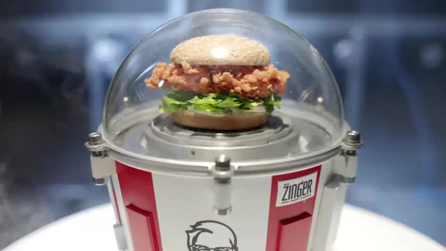
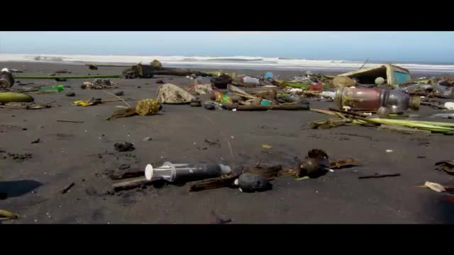

# Television Advertisement Classification

This repository is a part of a Google Summer of Code 2017 project for Red Hen Lab / CCExtractor

Red Hen has an existing visual feature based classification and labeling system for news videos, but TV commercials are not considered by the pipeline so far. I want to add a multimodal TV commercial classification system to the pipeline’s current capabilities.

This classification of commercials is into the following 23 categories:-
* 01_alcoholic-drinks-tobacco
* 02_automotive
* 03_business-equipment-services
* 04_consumer-public-services
* 05_culture-leisure-sport
* 06_fast-food-outlets-restaurants
* 07_health-pharmaceuticals
* 08_household-maintenance-pet-products
* 09_industrial-agriculture
* 10_non-alcoholic-drinks
* 11_publishing-media
* 12_transport-travel-tourism
* 13_apparel-clothing-footwear
* 14_banking
* 15_confectionery-snacks
* 16_cosmetics-beauty-products
* 17_dairy-products-eggs
* 18_grocery-other-foods
* 19_home-electronics-home-appliances
* 20_hygiene-personal-care-products
* 21_internet
* 22_public-awareness
* 23_retail-distribution-rental-companies

## Demo
A keyframe from 4 example test videos along with the outputs are shown below.

#### Example 1
File: kentucky-fried-chickenkfc-chamber-test-360-45192.mp4
Category: 06_fast-food-outlets-restaurants

Output:-
`The top 5 [labels : probabilites] in order are:-
[['06_fast-food-outlets-restaurants', 0.45471436972729862], ['23_retail-distribution-rental-companies', 0.10005687983793905], ['22_public-awareness', 0.092699812081264099], ['13_apparel-clothing-footwear', 0.080644128995197656], ['04_consumer-public-services', 0.054901739252063299]]`

#### Example 2
File: nike-skates-360-99472.mp4
Category: 13_apparel-clothing-footwear

Output:-
`The top 5 [labels : probabilites] in order are:-
[['13_apparel-clothing-footwear', 0.51708157997511861], ['22_public-awareness', 0.18499881764358048], ['04_consumer-public-services', 0.16289945019604854], ['01_alcoholic-drinks-tobacco', 0.061124437368357168], ['06_fast-food-outlets-restaurants', 0.023659305755164235]]`

#### Example 3
File: uefa-together-we-play-strong-360-61902.mp4
Category: 05_culture-leisure-sport

Output:-
`The top 5 [labels : probabilites] in order are:-
[['05_culture-leisure-sport', 0.89002430691967704], ['15_confectionery-snacks', 0.043071130712228789], ['12_transport-travel-tourism', 0.025212416302817134], ['02_automotive', 0.023489738645691184], ['22_public-awareness', 0.0077147928995272754]]`

#### Example 4
File: corona-the-oceans-360-34498.mp4
Category: 01_alcoholic-drinks-tobacco

Output:-
`The top 5 [labels : probabilites] in order are:-
[['22_public-awareness', 0.5100584880878537], ['01_alcoholic-drinks-tobacco', 0.31181776194454913], ['02_automotive', 0.094240187919956253], ['04_consumer-public-services', 0.024657759607296301], ['05_culture-leisure-sport', 0.02131677328555057]]`

We can see that the predictions usually make sense. The failure cases are those in which the actual category is something but the visual features of the advertisement are not exactly in line with it, e.g. an alcohol ad with no bottles shown, a food ad in which there are only two people talking and the brand name without actual food visuals etc. The classifier gets thrown off in these cases, which happens often in advertisements having implicit brand semantics which can't be understood by visual features alone. Nevertheless, performance is good in those cases where the visual features make sense and generically correspond to the correct category.

## Installation
Clone the repository, while ensuring that all dependencies are correctly installed.

## Usage

`python process_ad_video.py <ad-video-filename>`

This will automatically run the system to classify an incoming ad video provided everything is set up correctly.

An alternative form of usage that allows an entire news video to be processed and its commercials classified is coming soon.

## Dependencies
- Python (https://www.python.org/downloads/) : The language of the project. The code has been tested with Python 2.7.8 and 2.7.12. It should work with any recent version of Python 2.
- Caffe (https://github.com/BVLC/caffe) : Neural network framework. Needs to be complied with Python support (pycaffe). The code has been tested with Caffe rc3, and should work with the GitHub version.
- FFMpeg (https://github.com/FFmpeg/FFmpeg) : For video processing. The code has been tested with v2.8.2 and v3.1.0, and should work with the GitHub version.

## Training Details

I fine-tuned a standard 7 layer deep neural network using the modified AlexNet architecture using the Caffe deep learning framework with fairly standard parameters that are typically used for such a task. The dataset consisted of ad videos in 23 categories and nearly 8000 training points were supplied to the network for the fine tuning process.

The following is a plot of the training loss. The loss is the cost of wrong classification, i.e. a measure of how bad the network is learning the target concept. We want this to be as low as possible by the time of convergence, which is when the loss saturates and does not subsequently change much.

We can see that as the iterations progress, the loss more or less becomes stable at a low value which is indicative of training being complete, or not being able to improve further on the supplied training data.

The following is a plot of the network accuracy. There are three different kinds of accuracies that were measured, being the top-1 (standard accuracy), the top-3 (which refers to when the correct ad category is in the most likely top 3 out of the total 23 classes predicted by the network) and the top-5 (correct ad category in top 5 out of 23 classes).

The process gives us a best top-1 accuracy of 55.3%, a best top-3 accuracy of 83.2%, and a best top-5 accuracy of 89.75%.

These results are positive. A random classifier (chance, coin-toss, dice-roll etc) on the same dataset would give a top-1 accuracy of 4.34%, a top-3 accuracy of 13.04%, and a top-5 accuracy of 21.73%.

## Performance Details

Coming Soon

## Credits
- Places205-AlexNet model: 
	B. Zhou, A. Lapedriza, J. Xiao, A. Torralba, and A. Oliva
	Learning Deep Features for Scene Recognition using Places Database.
	Advances in Neural Information Processing Systems 27 (NIPS) spotlight, 2014.
	http://places.csail.mit.edu/downloadCNN.html
- Reference Caffenet model:
	AlexNet trained on ILSVRC 2012, with a minor variation from the version as described in ImageNet classification with deep convolutional neural networks by Krizhevsky et al. in NIPS 2012. Model trained by J. Donahue.
- Coloribus archive:
	Coloribus is a thoroughly collected and daily updated advertising archive, the biggest online collection of creative advertising pieces from all over the world. Highly structured database containing information about brands, agencies, people involved, awards and other very relevant data, combined with advanced full-text search engine.
- Red Hen Lab NewsScape Dataset:
	This work made use of the NewsScape dataset and the facilities of the Distributed Little Red Hen Lab, co-directed by Francis Steen and Mark Turner.
	http://redhenlab.org
