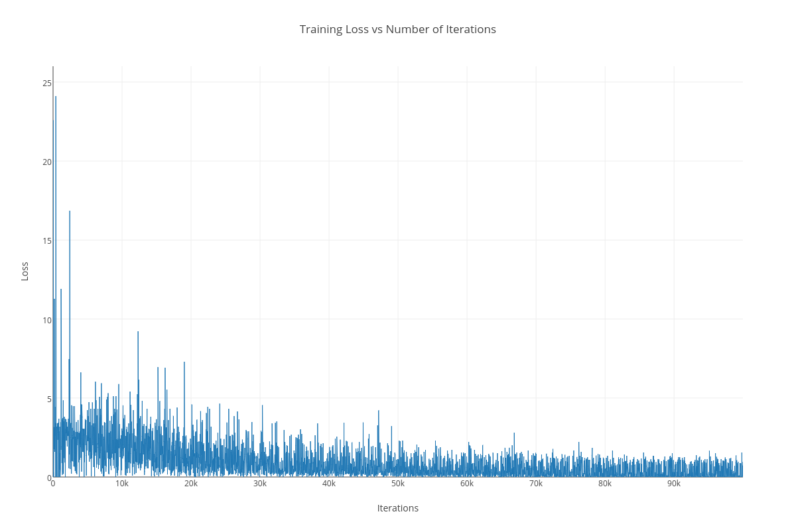
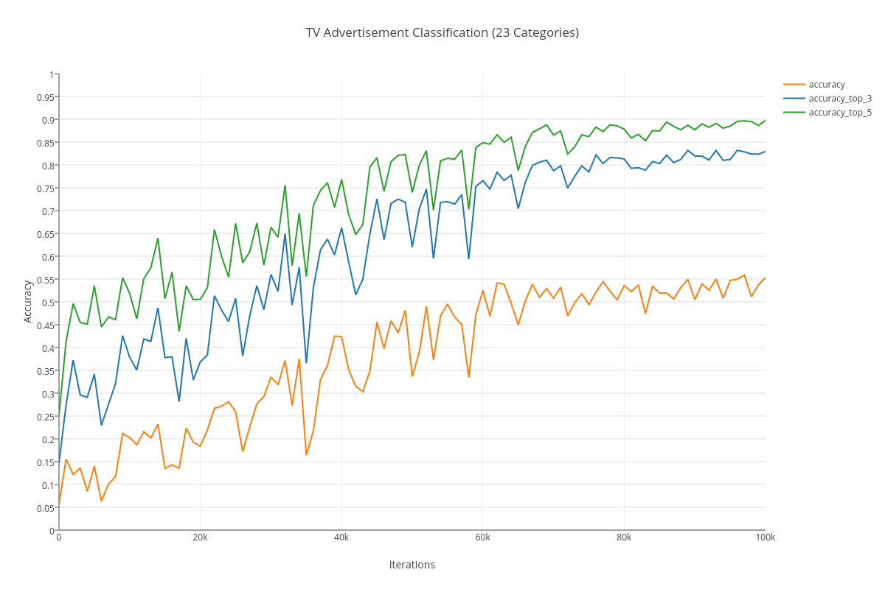

# Television Advertisement Classification

This repository is a part of a Google Summer of Code 2017 project for Red Hen Lab / CCExtractor

Red Hen has an existing visual feature based classification and labeling system for news videos, but TV commercials are not considered by the pipeline so far. I want to add a multimodal TV commercial classification system to the pipeline’s current capabilities.

This classification of commercials is into the following 23 categories:-
* 01_alcoholic-drinks-tobacco
* 02_automotive
* 03_business-equipment-services
* 04_consumer-public-services
* 05_culture-leisure-sport
* 06_fast-food-outlets-restaurants
* 07_health-pharmaceuticals
* 08_household-maintenance-pet-products
* 09_industrial-agriculture
* 10_non-alcoholic-drinks
* 11_publishing-media
* 12_transport-travel-tourism
* 13_apparel-clothing-footwear
* 14_banking
* 15_confectionery-snacks
* 16_cosmetics-beauty-products
* 17_dairy-products-eggs
* 18_grocery-other-foods
* 19_home-electronics-home-appliances
* 20_hygiene-personal-care-products
* 21_internet
* 22_public-awareness
* 23_retail-distribution-rental-companies

## Demo

Coming Soon

## Usage

python process_ad_video.py <ad-video-filename>

This will automatically run the system to classify an incoming ad video provided everything is set up correctly.

An alternative form of usage that allows an entire news video to be processed and its commercials classified is coming soon.

## Training Details

I fine-tuned a standard 7 layer deep neural network using the modified AlexNet architecture using the Caffe deep learning framework with fairly standard parameters that are typically used for such a task. The dataset consisted of ad videos in 23 categories and nearly 8000 training points were supplied to the network for the fine tuning process.

The following is a plot of the training loss. The loss is the cost of wrong classification, i.e. a measure of how bad the network is learning the target concept. We want this to be as low as possible by the time of convergence, which is when the loss saturates and does not subsequently change much.

We can see that as the iterations progress, the loss more or less becomes stable at a low value which is indicative of training being complete, or not being able to improve further on the supplied training data.

The following is a plot of the network accuracy. There are three different kinds of accuracies that were measured, being the top-1 (standard accuracy), the top-3 (which refers to when the correct ad category is in the most likely top 3 out of the total 23 classes predicted by the network) and the top-5 (correct ad category in top 5 out of 23 classes).

The process gives us a best top-1 accuracy of 55.3%, a best top-3 accuracy of 83.2%, and a best top-5 accuracy of 89.75%.

These results are positive. A random classifier (chance, coin-toss, dice-roll etc) on the same dataset would give a top-1 accuracy of 4.34%, a top-3 accuracy of 13.04%, and a top-5 accuracy of 21.73%.

## Performance Details

Coming Soon

## Credits

Coming Soon
